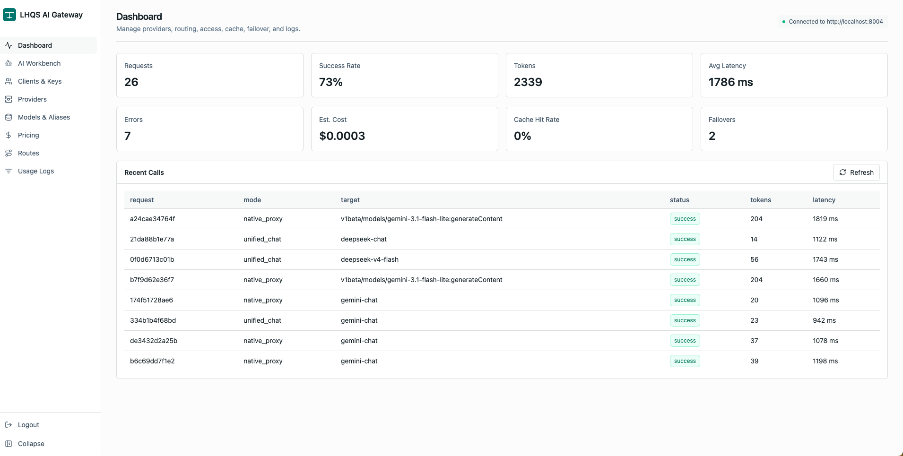
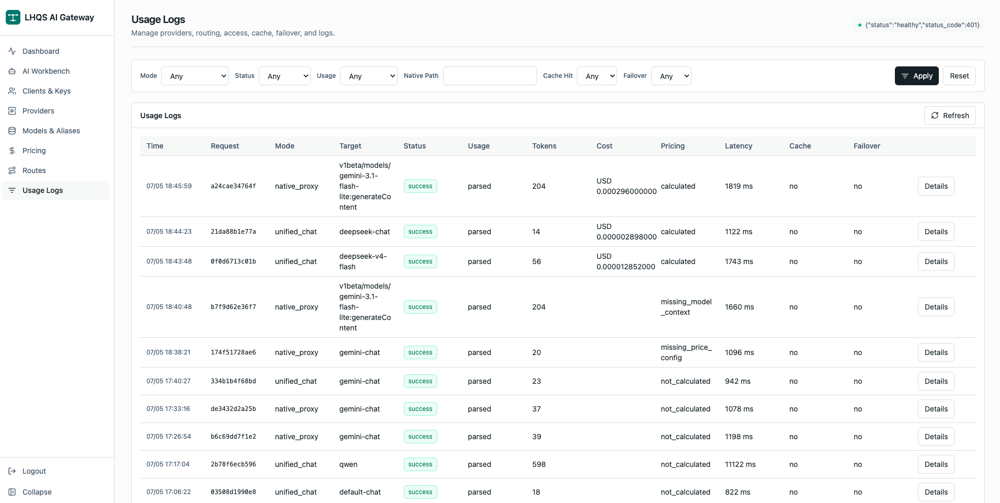
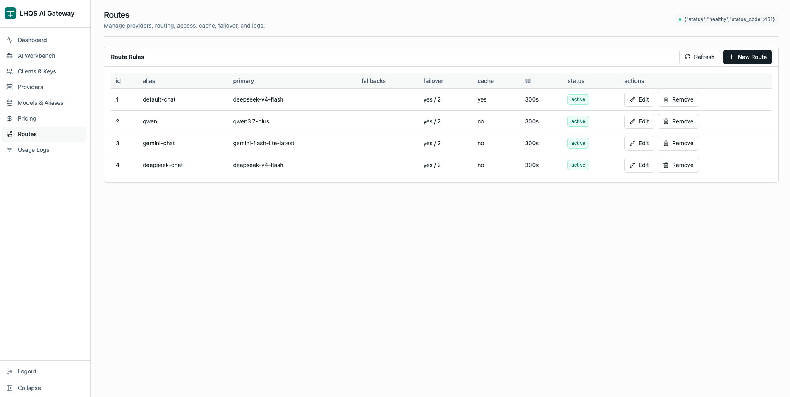
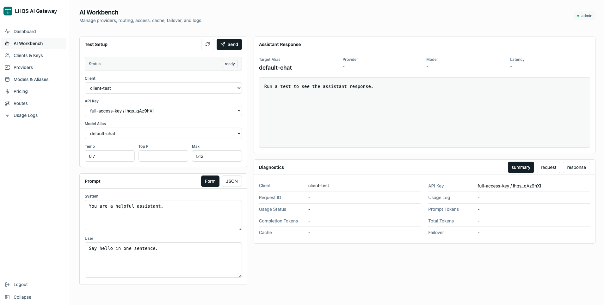
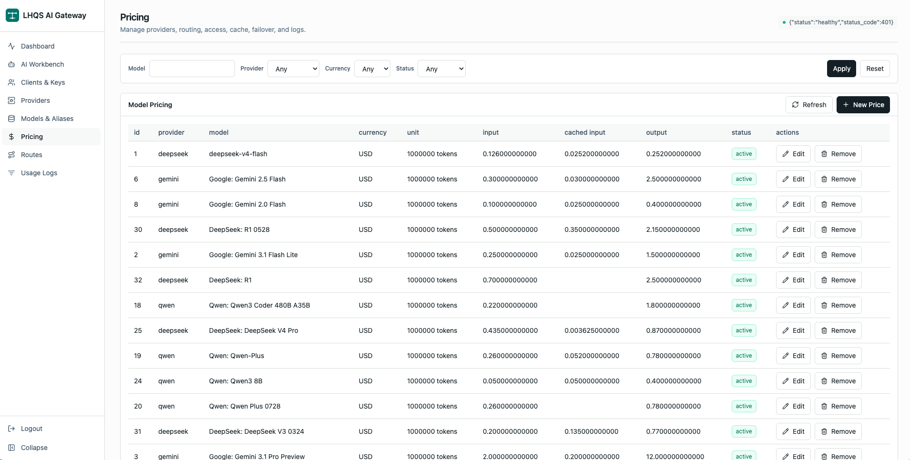

<div align="center">

# 🚀 LHQS AI Gateway

**一个自带控制台、统一协议 + 原生代理双模的 AI 网关**

OpenAI 兼容 / Gemini 原生 · 多供应商路由 · 自动故障转移 · 限流缓存 · 用量与计费 · React 管理后台

</div>

---

<p align="center">
  <em>把多家大模型供应商收敛到一个入口，统一鉴权、统一计费、统一治理 —— 同时不丢掉任何一家原生协议的能力。</em>
</p>

## ✨ 项目亮点

- 🧭 **双模接入**：对外一套 API Key，既能走 `/v1/chat/completions` 的 OpenAI 兼容统一协议，也能走 `/proxy/{provider}/{native_path}` 的供应商原生协议代理。
- 🔁 **自动故障转移**：主模型异常时，非流式请求整体 fallback、流式请求在首 token 前自动重试到备用模型，业务无感。
- 🧠 **模型别名 / 路由策略**：把 `gpt-4` 这样的别名映射到一组真实供应商模型，按权重和 fallback 策略灵活调度。
- ⚡ **高性能治理**：Redis 限流 + 非流式响应缓存，热请求零回源。
- 📊 **全链路用量观测**：记录 prompt / completion / 原生请求 / 原生响应，并解析 usage，统一计费。
- 🔐 **细粒度访问策略**：每个 Client / API Key 可分别限制可访问的别名、供应商、模型与原生路径。
- 🖥️ **开箱即用控制台**：React + Tailwind 管理后台，覆盖 Dashboard、用量、模型、路由、定价、工作台等场景。

## 🧩 功能一览

| 模块 | 能力 |
| --- | --- |
| 统一协议 | OpenAI 兼容 `/v1/chat/completions`，非流式 + 流式 |
| 原生代理 | `/proxy/gemini/...` 等，透传请求 / 响应、流式无缝 |
| 路由策略 | 模型别名、fallback、自动故障转移 |
| 治理 | Redis 限流、非流式缓存、流式首 token 守护 |
| 观测 | 用量日志、原生请求/响应留存、Gemini 流式 usage 解析 |
| 计费 | 内置模型定价表，按 token 计费 |
| 控制台 | Dashboard / Usage / Models / Providers / Routes / Clients / Pricing / Workbench |

## 🖼️ 项目截图

### Dashboard 总览
调用量、成本、错误率等核心指标一目了然。


### 用量明细
按模型 / 客户端维度的调用与计费明细。


### 模型与路由
模型别名配置、fallback 链路、故障转移策略。


### 控制台工作台
在线试用不同模型 / 供应商，快速验证路由与鉴权。


### 定价管理
内置模型定价表，按 token 统一计费。


## 🏗️ 架构总览

```
                ┌─────────────────────────────────────────┐
   Client ────▶ │  LHQS AI Gateway (FastAPI)              │
                │                                         │
                │  /v1/chat/completions   ──┐             │
                │  /proxy/{provider}/... ──┤  路由 / 别名 │
                │                          │             │
                │  限流 · 缓存 · 故障转移 · 日志 · 计费  │
                └───────────────┬─────────────────────────┘
                                │
        ┌───────────────────────┼───────────────────────┐
        ▼                       ▼                       ▼
   OpenAI-Compatible       Gemini Chat           Gemini Native
   (GPT / Claude / …)      Adapter               Proxy
```

## 🚀 快速开始

### 后端

```bash
cd backend
uv sync --dev
cp .env.example .env
uv run uvicorn app.main:app --reload
```

首次使用 PostgreSQL 时，按编号顺序执行 SQL 脚本：

```bash
cd backend
for file in app/db/sql/*.sql; do psql "$POSTGRES_DSN" -v ON_ERROR_STOP=1 -f "$file"; done
```

### 前端

```bash
cd frontend
npm install
cp .env.example .env
npm run dev
```

### 运行测试

```bash
# 后端
cd backend && uv run pytest

# 前端构建
cd frontend && npm run build
```

## 🗂️ 项目结构

```
lhqs-ai-gateway/
├── backend/
│   └── app/
│       ├── api/v1/         # 路由层
│       ├── services/       # 业务编排
│       ├── repositories/   # 数据访问
│       ├── providers/      # 供应商适配 (OpenAI / Gemini Chat / Gemini Native)
│       └── db/sql/         # SQL 脚本（不使用 Alembic）
├── frontend/
│   └── src/
│       ├── pages/          # Dashboard / Usage / Models / Routes / Workbench ...
│       ├── components/     # 通用组件与布局
│       └── lib/            # API 调用封装
└── docs/                   # 设计文档与实现方案
```

## 🔧 技术栈

- **Backend**: Python 3.12 · FastAPI · Pydantic v2 · SQLAlchemy · Redis · PostgreSQL
- **Frontend**: React · TypeScript · Vite · Tailwind CSS
- **Provider 适配**: OpenAI-Compatible · Gemini Chat · Gemini Native

## 📚 设计文档

- [AI 网关方案 V3](docs/ai-gateway-plan/ai-gateway-plan-v3.md)
- [AI 模型定价设计](docs/ai-gateway-plan/ai-model-pricing-design.md)
- [定价系统设计 V2](docs/ai-gateway-plan/pricing-system-design-v2.md)
- [生产环境与排障手册](docs/production-operations.md)

## 📌 说明

- 后端数据库变更以 `backend/app/db/sql/` 下编号 SQL 脚本管理，**不使用 Alembic**，**不使用外键**，关系由应用层保证。
- 生产环境建议保持 `STORE_API_KEY_VALUE=false`，完整 API Key 只在创建或轮换时展示一次。
- 欢迎 Issue / PR。涉及前端可见变更的 PR，请附截图。

<div align="center">

<sub>Made with ❤️ — 把复杂的供应商差异留给网关，把简单的能力留给业务。</sub>

</div>
